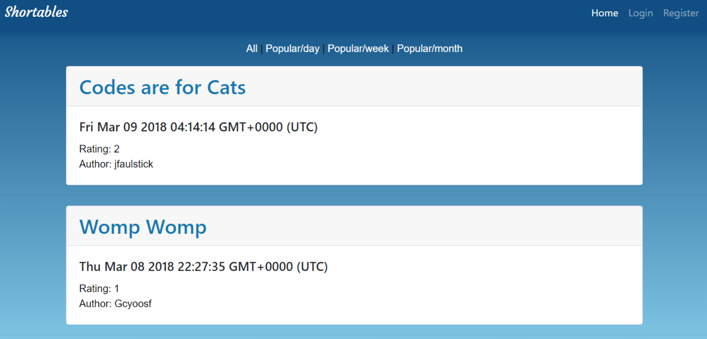
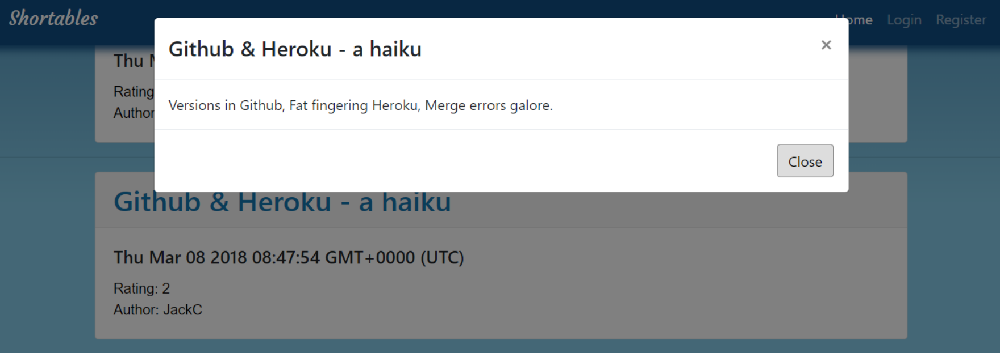
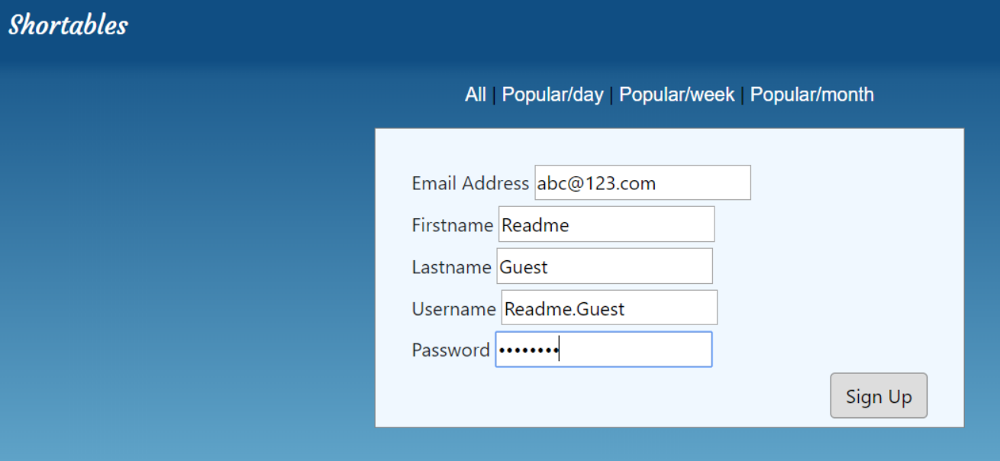
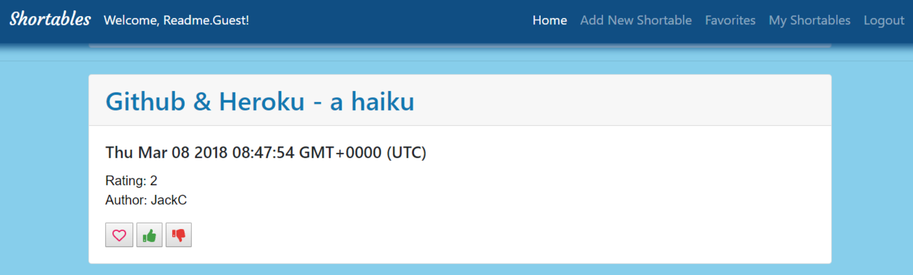
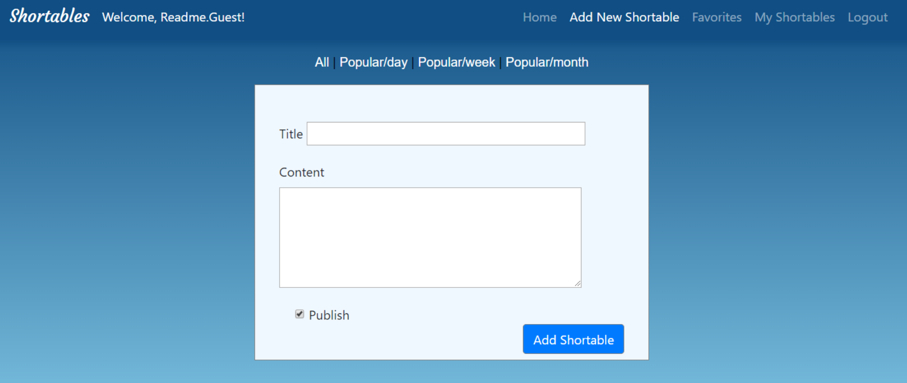

# Shortables

Shortables is project 2 of 3 for the UC Berkeley Full Stack Programming Boot Camp.

It is a networking app for lovers of literature, reading and writing.

<a href="https://shortables.herokuapp.com/">Here</a> is a link to the project on Heroku.

# Home page

The home page displays submitted content. 

Without logging in the guest can only read posts.

Guests can register to enable submission of new posts, as well as like/dislike user-submitted posts and add favorites amongst other features.

 

 

# Technologies

- Node and Express Web Server
- MVC Architecture
- MySQL / Sequelize ORM  
- Passport.js
- Handlebars.js
- Bootstrap
- JQuery/AJAX
- Nightmare.js

